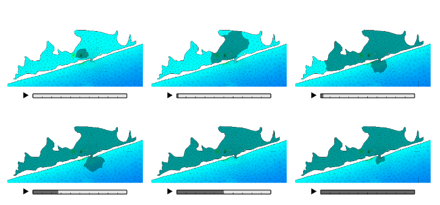
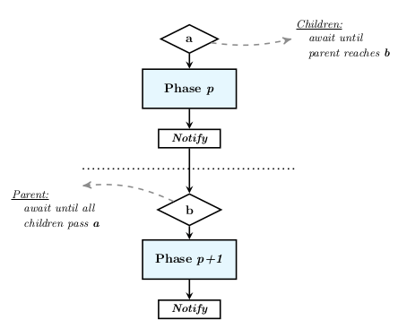

# OpenHDM
### An Open-Source Software Framework for Hydrodynamic Models

OpenHDM is designed to facilitate adaptive grid behavior and to utilize concurrent and hierarchical executions of multiple domain instances by means of dynamic containers and object-oriented design principles.

### Models developed with OpenHDM:

A simple finite-volume shallow water equations solver, called ASMFV, and the reimplementation of an advanced finite-element ocean circulation model, called ADCIRC++, have been developed using OpenHDM. Links to the repositories:

- [ASMFV](https://github.com/alperaltuntas/asmfv)
- [ADCIRC++](https://github.com/alperaltuntas/adcircpp) (private)

### Class Diagram of OpenHDM:

The framework consists of class templates and abstract classes that can accommodate hydrodynamic models based on different numerical methods and formulations .

### Grid-Patch Pair:

Discrete model data in OpenHDM is maintained by a Grid-Patch pair, where the former is the container of the actual data e.g., nodes elements, etc., that is resized relatively less frequently in runtime, and the latter is a virtual view of a subset of the data, providing a level of indirection and allowing the designation of the active regions of the grid in a highly dynamic manner.

### Phasing Mechanism:

The concurrent execution of domains which may be defined in a hierarchy is synchronized through a phasing mechanism, where, at each timestep, the phase functions, each including a portion of the timestepping tasks, of domains are either executed or blocked depending on several criteria regarding the relative progressions of domains within the timestep. 

